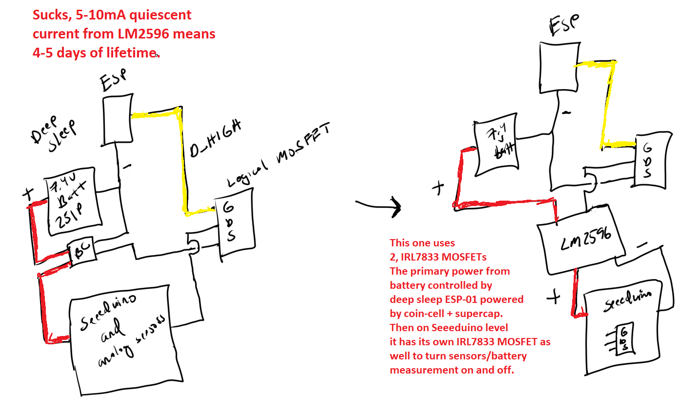
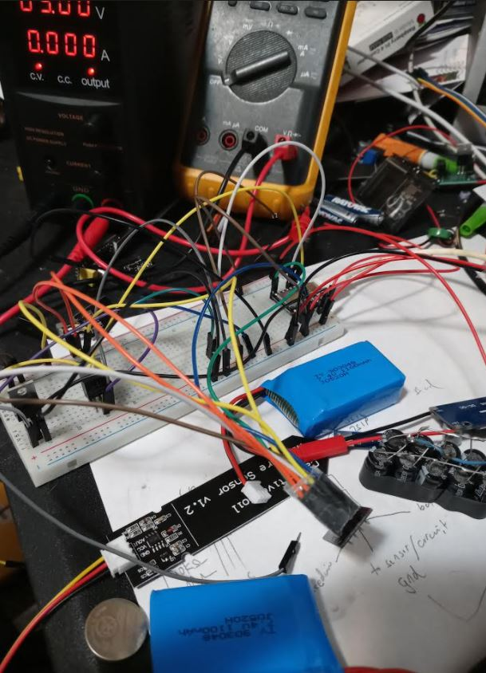
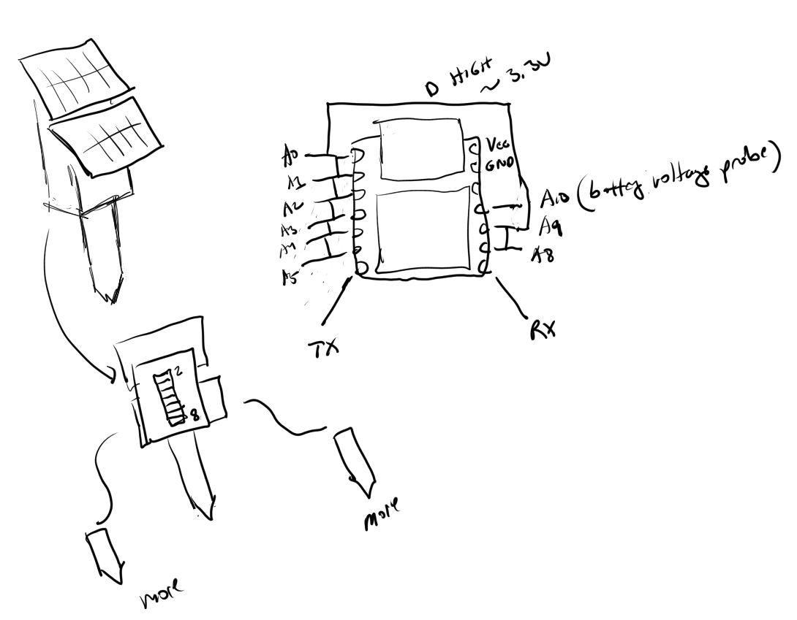

### Tasks for low power design

- [ ] setup coin cell supercap based ESP-01 for deep sleep
  ~~- [ ] design and print coin sleeve compressed wire holder~~
  ~~- [ ] find cap/resistor and connect~~
    - I don't have a supercap... or one that is rated at 3V, lowest is 6.3V at 1000uF. I think it will stop at 3V/matching battery right?
      Oh... that's why it's a super cap all of mine are micro
      I just lucked out, I thought this part on a random board is a capacitor but it's a 3V battery... neat. I have no idea of its capacity though.
      well this battery may be from 1989 but that's alright... yeah... so it was like 0.5V under load haha... now measures 2.75V ahh... so it's dead. I actually... can just go to a store and buy a 3V coincell battery... ahh this is not good trying to figure out what to power the ESP-01 with.
  - [ ] verify it works on its own
  - [ ] can turn on the main circuit(big battery and seeeduino can work)

# 03/17/2021
I think today is it. I can finally finish this project and the device should last a month long or more. I am finally done buying parts... it's stressful ordering parts regarding delivery completion.

So today I have to finalize the electronic layout, solder everything, design the cases, print all the parts and assemble it. Then do the web interface to store/get this data and display it with some interface.

Ugh... this is depressing. Yesterday all the electronics were working well where at 0 the MOSFET drain had no leakage... now in low state there is some voltage coming out.

Ehh... I forgot I set a sleep of 1 hour on the Seeeduino

Oh I see it is pretty much 0 if I'm measuring the drain directly with a multimeter, I had it also parallel connected to the moisture sensor.

The ESP stopped transmitting though trying to figure that out.

Ugh... mega fail today... my previously working serial com Seeeduino to ESP-01 stopped working.

I got back to a working state but without a super cap this thing may be dead in the water unless I accept defeat and use 2 AA/AAA cells or something. Or... order more parts ahhhhhh

Had me scurrying like a rat for no reason. Ultimately may have bene pointless. I just split my 4AAA NiMh pack from my Alula (that I pretty much destroyed last time I slope soared) so I had a 2S pack.

Well... that also doesn't work. Not enough current to work ugh... failure failure failure

Side note I bought my first composite 1.5m DLG ever damn they're expensive

Gotta get back to my roots, that open field, peace of mind, being

This is the circuit design I'm trying to do now. Seems I gotta get the timing right when things turn on/off.

AHHHHHHHHHHHHHHHHHHHHHHHHHHHHHHHHH

I have dumped so much time into this project. Here is a new idea... I will just use an LD33V like a noob, it'll come after the single cell BMS and then it'll last as long as the estimated 1 month from the 2S pack... who knows if it'll last this long. Circuit below explaining the wiring from a higher up context.

Reality: this is 6hrs gahhh

# 03/16/2021
I have all the parts I need now. I am doing a "quick" power consumption check. There are a few ways to go about optimizing power consumption, maybe through deep sleep/power cutting, almost 0. But I don't want to get sucked into all that, I'll come up with a solution and within this week I will finish up this project. I'm going to design these snap-together splash-proof headers for the moisture sensors so they should generally be safe from watering. They'll only be on for a couple seconds so I don't think heat is a big concern eg. vents.

One of the main problems is while I have options to get into deep sleep there's no way to have the battery severable without something running to wake it up. The ESP-01 I modded to do that(wake itself from deep sleep)...

I don't know maybe if I use two logic mosfets and one manages power for the whole thing, the other manages power for the sensors... it could work. Then the ESP-01 is the "master" brain sleep thing.

I'll just have to check networking/serial still works in that mode. It may make this project less re-producible but hardly anything I've built people made too so oh well.

The test run I did:

Starting voltage 7.7V
Transmitting every 10 minutes
Seeeduino and ESP-01 constantly on, logic MOSFET turning on/off to power analog sensor during sampling. Power is up for 5 seconds then measure/off.
Did this for 4 hours.

Dropped to 7.3V... which I don't know what that means ha.
But I'll compare it against the deep sleep wiring version.

I think my "safe voltage" cutoff would be 6.4V as in 3.2V per cell. The BMS has an overcharge protection voltage of I think 3.0V below that the battery is "off".

I have to figure out the new wiring... not sure if I will try the coincell route, because I think I will have to do that supercap mod to be able to transmit.

# 03/13/2021
I tested the IRL7833 today, it seems to work well. I would get the full 100% voltage or 0.010V on low state. Guess that's good enough. I am order more parts yet again... this time a BMS people suggested. I'll be working on designing the body but I think I have everything figured out now... I just gotta finish it.

### 03/10/2021
I ordered a bunch of parts for electronic switching so I'm delayed again. I also decided to just abandon the solar cells. I tried it on a 4-cell can battery set and they didn't do jack squat. So... going for decent battery capacity and hopefully low-ish draw over time. I still want the 8 analog inputs and voltage sensor capability. I ordered some 2N2222A transistors(testing those now). I also ordered some logic-level MOSFETs as the other ones I bought are not that... can't be triggered reliably with pins from an Arduino. Those are IRL7833 which I have not received yet. The battery is a 2S pack LiPo 1.1Ah capacity. Interestingly I also ordered these 3Ah Li-ion cells with built in chargers. I could step those up to 5V and in theory have more capacity than the 2S packs... either way some regulation is needed. I think I'll save the cell batteries for the small robot.

Alright testing this 2N2222A transistor now, never used one before. Intent is to turn a power source on/off that will power all the sensors in parallel and also the voltage sampling(by voltage divider). It's the same as the MOSFET as far as me not knowing how to wire it.

Luckily I have 200 tries to get it right lol... insane I had to buy a giant bag otherwise a smaller bag would have costed more funny.

So I think base is the trigger voltage, collector is the input voltage and then emitter is the "ground" or release voltage.

Hmm it is working but the max voltage is 2.810V and low is 0.022V vs. the input voltage of 5V

Yeah... so I guess that's [expected](https://electronics.stackexchange.com/a/125670/80759) about the voltage drop.

Well I'll get the logic MOSFETs in tomorrow will try those.

### 03/04/2021
This is the plan I have now. I will stagger-connect the analog pins and use the previous pin to power the next pin when doing a measurement by digital out. I think it's just under the operating voltage of the moisture sensor but this way the sensors aren't always on. Since now it can support up to 8 moisture sensors(wanted to use all pins). So the design has changed too, see the drawing below. Will have a port to accept more moisture sensors. The code will scan all analog values and send them but the web interface can say if it will ignore them or not. I'll also measure the voltage of the device so I can tell when I need to charge it. The intent at the moment is to constantly charge the battery with something like 30mA... I think generally the whole unit will only use around that amount at a time. The Seeeduino has an operating current looks like of [13.3mA](https://twitter.com/nicho810/status/1287990412758487040?lang=en).

The wiring will not be exactly like this. I realize a pin can power the pin to it's left/right. Also maybe you only need at least 2... the one that is not measuring powers any other pin by parallel wiring. This does work, I tested it but only one set eg. A0 to A1. Yeah I think really A0 could power all the pins and A1 can power A0.They are only one for 1 second to do a measurement. Each pin can only do 7mA and the sensor has an operating current of 5mA so it's one pin at a time while sampling.

I don't have any relays is the problem, I'm done ordering parts for a while as it's a stressful thing to do with my current living situation. I've lost at least 5 things already due to delivery problems.

Oh man... I don't think this will work actually. If the sensors are physically connected they will draw power. I will have to think about this may have a gross oversight.
### 03/03/2021
So I got the hardware serial to work which is good because I tried software serial before and it sucks/not reliable. Initially struggled with the `Serial` write not being detected by ESP but saw the `Serial1` variant for Seeeduino. Oh wow I guess this is a thing, didn't know about it ["logic level serial"](https://stackoverflow.com/questions/21944925/arduino-serial1) cool. Anyway it all works, transmits. I almost forgot to do the flush buffer thing till I started to see it concatenate in the Node server logs.

### 03/02/2021
Here we go again... just got the Seeeduino, soldered the male headers on and powered it on through the 5V. Looks like it is preloaded with some blink sketch.

Ehh.. I'm burnt today I have to program the ESP-01 then program Seeeduino then wire them up. Using this [page](https://www.instructables.com/Serial-Communication-Between-Arduino-and-ESP-01/) for the serial wiring.