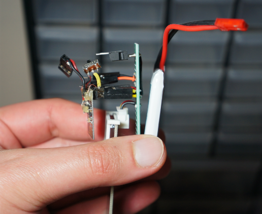
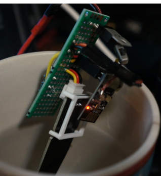

### Tasks

- [ ] interface with sensor
  - [x] get it turned on, get values out regarding dry, in water, compare
    - [x] measure sensor output
  - [ ] use ESP to read it (need divider)
- [ ] write basic code for ESP01
- [ ] design parts
- [ ] print
- [ ] assemble
- [ ] deploy
- [ ] write server side code
- [ ] write basic "mobile" app

### 02/21/2021 the sensor died
I only have one... ugh. I got this far though

I did wire it all up and had it working, just for whatever reason the sensor died/not outputting values on analog.

### 02/20/2021 initial dev
Connected it all up to DMM dry run got 2.746V
1.069V fully submerged up to top line in tap water

