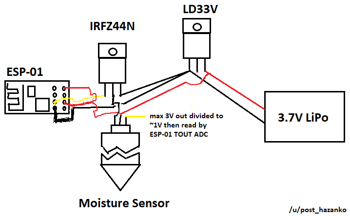
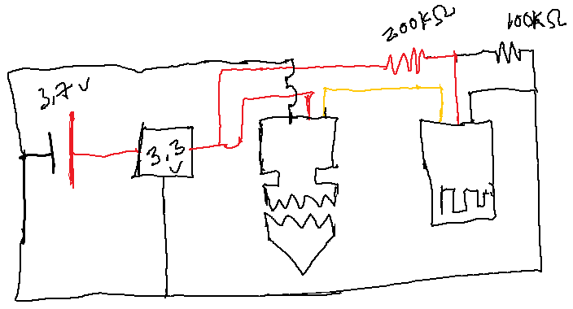

### About
This approach "failed".

Specifically I could not step the voltage down from the 3V max output of the analog sensor output for the ESP to consume it through the 1V max ADC.

This is one of the configurations I tried(other didn't have the MOSFET)

The on/off aspec works great, but as mentioned anytime I tried to drop the voltage down it would make the sensor not work.

Normally the sensor outputs between 2.2-2.6V in air and drops to 1.2V or so "fully submerged" in a cup of water.

That stops happening once I try to mod the output voltage.

I don't have any other components/parts at the moment to drop that voltage down and have spent far too much time on this version.

I just want "a moisture sensor" and I have these other ESP's to work with now.

I want to finish this project and move on.

The other version without MOSFET

Here it is wired up

